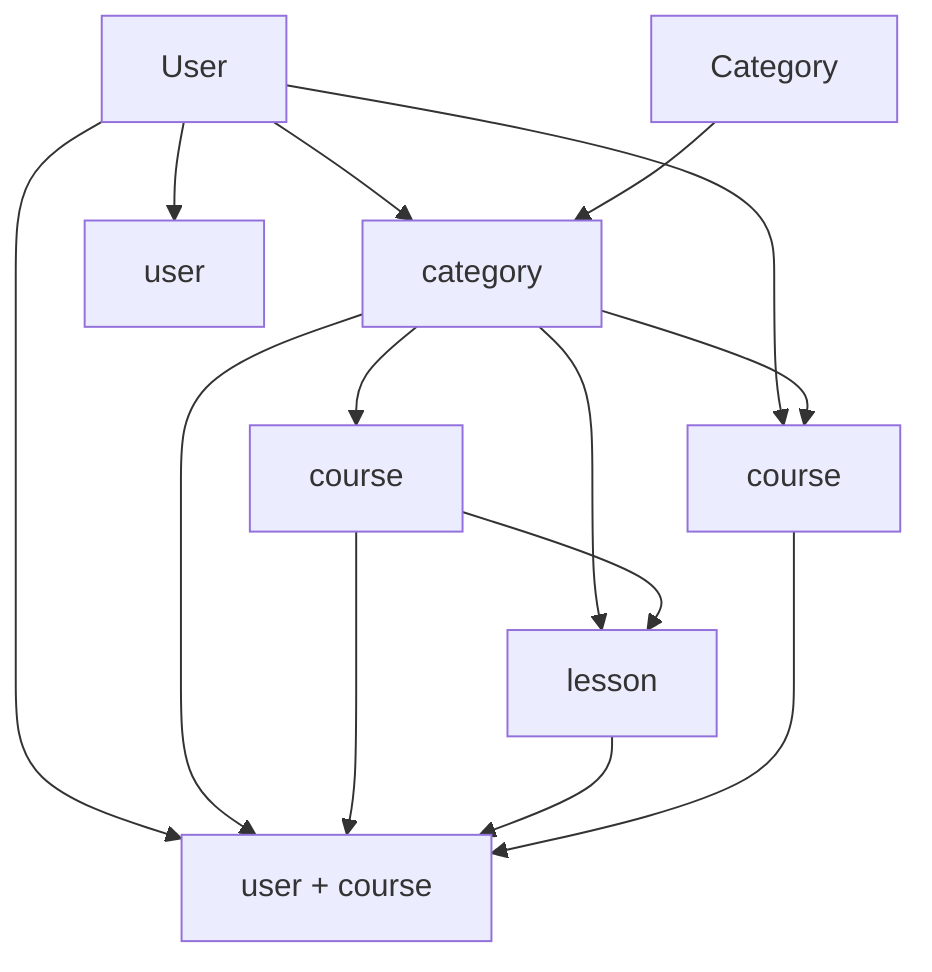

# Database Models Documentation

This document describes all the Mongoose models used in the Educational Platform backend.

## 📁 Models Overview

### 1. User Model (`User.js`)
**Purpose**: Manages user accounts, authentication, and profiles

**Fields**:
- `firstName`, `lastName` - User's name
- `email` - Unique email address
- `password` - Hashed password (not returned in queries)
- `role` - User role: `student`, `instructor`, or `admin`
- `avatar` - Profile picture URL
- `bio` - User biography
- `isActive` - Account status
- `emailVerified` - Email verification status
- `resetPasswordToken/Expire` - Password reset functionality

**Methods**:
- `comparePassword()` - Compare entered password with hashed password
- `fullName` virtual - Returns full name

---

### 2. Category Model (`Category.js`)
**Purpose**: Organizes courses into categories/topics

**Fields**:
- `name` - Category name (unique)
- `description` - Category description
- `slug` - URL-friendly version of name
- `icon` - Category icon/emoji
- `isActive` - Category status
- `createdBy` - User who created the category

**Features**:
- Auto-generates slug from name
- Unique name constraint

---

### 3. Course Model (`Course.js`)
**Purpose**: Main course content and structure

**Fields**:
- `title`, `description` - Course information
- `instructor` - Reference to User model
- `category` - Reference to Category model
- `thumbnail` - Course image
- `price`, `isFree` - Pricing information
- `level` - Difficulty level
- `duration` - Course length in hours
- `prerequisites` - Array of prerequisite requirements
- `learningOutcomes` - Array of learning objectives
- `status` - Draft/published/archived
- `sections` - Array of course sections with lessons
- `rating` - Average rating and count
- `enrollmentCount` - Number of enrolled students

**Virtuals**:
- `totalLessons` - Total number of lessons
- `url` - Course URL path

---

### 4. Lesson Model (`Lesson.js`)
**Purpose**: Individual lesson content within courses

**Fields**:
- `title`, `description` - Lesson information
- `content` - Main lesson content
- `contentType` - Type: `video`, `text`, `quiz`, `assignment`, `interactive`
- `videoUrl` - Video content URL
- `duration` - Lesson length in minutes
- `order` - Position in section
- `isPreview` - Free preview availability
- `attachments` - Downloadable files
- `resources` - External resources
- `section` - Parent section reference
- `course` - Parent course reference

**Virtuals**:
- `url` - Lesson URL path

---

### 5. Enrollment Model (`Enrollment.js`)
**Purpose**: Tracks student course registrations and progress

**Fields**:
- `student` - Reference to User model
- `course` - Reference to Course model
- `enrollmentDate` - Registration date
- `completionDate` - Course completion date
- `progress` - Progress tracking object
  - `completedLessons` - Array of completed lesson IDs
  - `currentLesson` - Current lesson reference
  - `percentage` - Completion percentage
- `status` - `active`, `completed`, or `dropped`
- `certificateIssued` - Certificate status
- `rating` - Course rating and feedback

**Features**:
- Unique student-course combination
- Progress tracking
- Certificate management

---

### 6. Quiz Model (`Quiz.js`)
**Purpose**: Assessment and evaluation tools

**Fields**:
- `title`, `description` - Quiz information
- `course` - Parent course reference
- `lesson` - Associated lesson (optional)
- `questions` - Array of question objects
  - `question` - Question text
  - `type` - Question type
  - `options` - Answer choices
  - `correctAnswer` - Correct answer
  - `points` - Question points
  - `explanation` - Answer explanation
- `duration` - Time limit in minutes
- `passingScore` - Minimum score to pass
- `attemptsAllowed` - Number of allowed attempts
- `shuffleQuestions` - Randomize question order

---

### 7. Progress Model (`Progress.js`)
**Purpose**: Detailed progress tracking for individual activities

**Fields**:
- `user` - Reference to User model
- `course` - Reference to Course model
- `lesson/quiz` - Specific activity reference
- `progressType` - `lesson`, `quiz`, or `assignment`
- `status` - `not-started`, `in-progress`, or `completed`
- `startTime`, `endTime` - Activity timing
- `timeSpent` - Total time spent in minutes
- `score` - Quiz/assignment score
- `answers` - Detailed answer tracking
- `completedAt` - Completion timestamp
- `lastAccessed` - Last activity timestamp

---

### 8. Notification Model (`Notification.js`)
**Purpose**: User notifications and alerts

**Fields**:
- `user` - Target user reference
- `title`, `message` - Notification content
- `type` - Notification type: `info`, `success`, `warning`, `error`, `course_update`, `enrollment`, `quiz_result`
- `relatedEntity` - Associated entity reference
- `isRead` - Read status
- `readAt` - Read timestamp
- `priority` - `low`, `medium`, or `high`
- `actionUrl` - Link to related content

## 🔗 Model Relationships



## 🛠️ Usage Examples

### Creating a User
```javascript
const user = new User({
  firstName: 'John',
  lastName: 'Doe',
  email: 'john@example.com',
  password: 'password123',
  role: 'student'
});
await user.save();
```

### Creating a Course with Sections
```javascript
const course = new Course({
  title: 'Introduction to Programming',
  description: 'Learn programming basics',
  instructor: userId,
  category: categoryId,
  sections: [
    {
      title: 'Getting Started',
      order: 1,
      lessons: [lessonId1, lessonId2]
    }
  ]
});
```

### Tracking Enrollment Progress
```javascript
const enrollment = new Enrollment({
  student: userId,
  course: courseId,
  progress: {
    completedLessons: [lessonId1],
    currentLesson: lessonId2,
    percentage: 25
  }
});
```

## 📊 Indexes and Performance

All models include appropriate indexes for:
- Unique constraints (email, category names)
- Compound queries (user + course combinations)
- Text search (course titles, descriptions)
- Sorting and pagination

## 🔒 Security Features

- Password hashing with bcrypt
- Field validation and sanitization
- Reference integrity through Mongoose refs
- Selective field exposure (password field hidden)